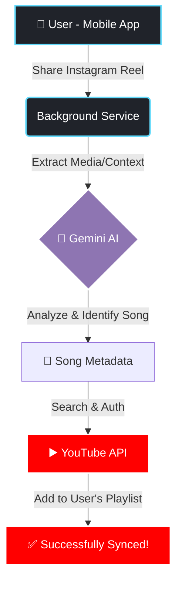

<div align="center">


# 🎵 Insta2YouTube: Your Ultimate Reel to Playlist Syncer

[](#)
[](#)
[](#)
[](#)

A full-stack cross-platform app that automatically identifies songs from Instagram Reels using AI and adds them directly to your YouTube playlists. 🚀

[**Live Demo**](https://insta2-you-tube.vercel.app/) • [**Report Bug**](https://github.com/buildbyabhi/Insta2YouTube/issues) • [**Request Feature**](https://github.com/buildbyabhi/Insta2YouTube/issues)

</div>

---

## 🌟 About The Project

Ever liked a song on an Instagram Reel but forgot to add it to your playlist? **Insta2YouTube** solves exactly this! By leveraging the power of Google's Gemini AI, this app analyzes shared Reels, identifies the background track, and automatically adds it to your chosen YouTube playlist. 

### 🏗️ Architecture Flow



### ✨ Features
- **Seamless Integration:** Share an Instagram Reel directly to the app.
- **AI-Powered Identification:** Uses Gemini AI to accurately identify songs.
- **YouTube Sync:** Automatically adds the identified song to your YouTube playlist.
- **Cross-Platform:** Built with React Native to work natively on your mobile device.
- **Clean UI:** Simple, intuitive, and modern user interface.

---

## 🚀 Getting Started

Follow these steps to set up the project locally on your machine.

### Prerequisites
- Node.js (v18 or higher)
- npm or yarn
- React Native environment setup
- API Keys: Google Gemini API, YouTube Data API v3

### Installation

1. **Clone the repository**
   ```bash
   git clone https://github.com/buildbyabhi/Insta2YouTube.git
   cd Insta2YouTube
   ```

2. **Install dependencies**
   ```bash
   npm install
   # or
   yarn install
   ```

3. **Set up Environment Variables**
   Create a `.env` file in the root directory and add your API keys:
   ```env
   GEMINI_API_KEY=your_gemini_api_key_here
   YOUTUBE_API_KEY=your_youtube_api_key_here
   ```

4. **Run the App**
   ```bash
   npm run start
   ```

---

## 🛠️ Tech Stack
- **Frontend:** React Native, Expo
- **Backend/Logic:** Node.js, Express (if applicable)
- **AI:** Google Gemini API
- **External Services:** YouTube Data API v3

---

## 🤝 Contributing
Contributions are what make the open source community such an amazing place to learn, inspire, and create. Any contributions you make are **greatly appreciated**.

If you have a suggestion that would make this better, please fork the repo and create a pull request. You can also simply open an issue with the tag "enhancement".

**Don't forget to give the project a star! Thanks again! ⭐**

1. Fork the Project
2. Create your Feature Branch (`git checkout -b feature/AmazingFeature`)
3. Commit your Changes (`git commit -m 'Add some AmazingFeature'`)
4. Push to the Branch (`git push origin feature/AmazingFeature`)
5. Open a Pull Request

---

## 📬 Contact
**Abhishek Kumar**
- GitHub: [@buildbyabhi](https://github.com/buildbyabhi)
- Email: buildbyabhi.dev@gmail.com
- Portfolio: [buildbyabhi.github.io](https://buildbyabhi.github.io/)

---
<div align="center">
  <i>Made with ❤️ by Abhishek</i>
</div>
